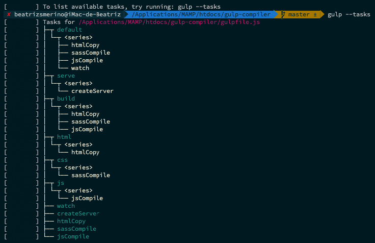

# Gulp compiler


## 🎯 Description

Gulp Compiler is a basic code for automate the tasks of your development environment with the task runner `Gulp`.
This project has functions for create a **server**, **copy and paste** folders/files, **compile** and **compress** files and **watch** his changes.

## 🏗️ Developed with

Is developed with [gulp](https://gulpjs.com/) 4.0.0 a task runner and javascript.

`Gulp` is a toolkit for automating painful or time-consuming tasks in your development workflow, so you can stop messing around and build something.

More information: [Introduction to gulp](https://dolphinandmermaids.com/blog/gulp-examples)

## 🧩 Content

The `SASS` and `JS` compilation tasks pick up the files in the `src` folder and generate a new `dist` folder with the results.

- Input structure folders

    ```shell
    src/
        sass/
            styles.sass
        js/
            scripts.js
        index.html
    ```

- Output structure folders

    ```shell
    dist/
        css/
            styles.min.css
        js/
            scripts.min.js
        index.html
    ```

## 🔑 Required

> You can skip this section if you already have NODE, NPM and GULP.

### Installs the necessary

1. Install [Node](https://nodejs.org/es/) and [NPM](https://docs.npmjs.com/)

    - If you are on MAC you can do it with line of following these steps

        - First, install [Homebrew](https://brew.sh/index_es)

        ```shell
        /bin/bash -c "$(curl -fsSL https://raw.githubusercontent.com/Homebrew/install/HEAD/install.sh)"
        ```

        - Next, install Node (npm will be installed with Node):

        ```shell
        brew install node
        ```

    - Or install node and npm together with this program: [Download](https://www.npmjs.com/get-npm)

2. Install [Gulp 4.0.0](https://gulpjs.com/)

    - Install gulp globally

        ```shell
        npm install --global gulp-cli
        ```

    - Install gulp inside project

        ```shell
        npm install gulp
        ```

### Check the packages installed

1. To test out your `NODE`, `NPM` and `GULP`, check versions installed

    - Check version of node

        ```shell
        node --version
        ```

    - Check version of npm

        ```shell
        npm --version
        ```

    - Check version gulp

        ```shell
        gulp --version
        ```

2. Check the globally installed packages

    ```shell
    npm list -g --depth=0
    ```

## 🚀 How use



### If you already have node, npm and gulp

1. After installing everything you need, cloning this repository.

    ```shell
    git clone https://github.com/beatrizsmerino/gulp-compiler.git
    ```

2. For end, you must launch this command, for download the NPM packages and get the dependencies of configuration file [package.json](package.json).

    ```shell
    npm install
    ```

### Gulp tasks availables

- You can to list available the gulp tasks of this project, using the command

    ```shell
    gulp --tasks
    ```

## 🚀 NPM

<details>
    <summary>
        <h3>
            Project setup
        </h3>
    </summary>
    <div>
        <p>
            After cloning this repository, you need to install the required NPM packages.
        </p>
    </div>
</details>
<pre><code>npm install</code></pre>

<details>
    <summary>
        <h3>
            Deploy
        </h3>
    </summary>
    <div>
        <p>
            After development, you can publish the content of the <code>dist</code> folder on Github Pages (<code>gh-pages</code> branch).
        </p>
    </div>
</details>
<pre><code>npm run deploy</code></pre>

## 🚀 GULP

In the [gulpfile.js](gulpfile.js) of this proyect you can see the **gulp tasks** developed to compile and compress the `SASS` and `JS`, copy and paste the `HTML` files, create a server and listen to the changes made to reload it ([Browsersync + Gulp.js](https://browsersync.io/docs/gulp))

This version use `gulp.series()`, combines task functions and/or composed operations into larger operations that will be executed one after another, in sequential order.

<details>
    <summary>
        <h3>Run server and watch changes</h3>
    </summary>
    <div>
        <p>This is the default gulp task</p>
        <p>This command is able to:</p>
        <ol>
            <li>Creates the <code>dist</code> folder if it does not exist.</li>
            <li>Generate <code>html</code>, <code>css</code>, <code>js</code> on <code>dist</code> folder.</li>
            <li>Watch the changes to the files in the <code>sass</code> and <code>js</code> folders inside the <code>src</code> folder.</li>
            <li>Create a server and reloads if there are any changes in those files of <code>dist</code> folder.</li>
        </ol>
    </div>
</details>
<pre><code>gulp</code></pre>

<details>
    <summary>
        <h3>Run server</h3>
    </summary>
    <div>
        <p>This creates a static server with the browserSync package, serves the files from <code>dist</code> folder, and opens by default the <code>index.html</code> file in any of these browsers: Chrome & Firefox.</p>
    </div>
</details>
<pre><code>gulp serve</code></pre>

<details>
    <summary>
        <h3>Generate html, css, and js</h3>
    </summary>
    <div>
        <p>This command is able to:</p>
        <ol>
            <li>Creates the <code>dist</code> folder if it does not exist.</li>
            <li>Generate <code>html</code>, <code>css</code>, <code>js</code> on <code>dist</code> folder.</li>
        </ol>
    </div>
</details>
<pre><code>gulp build</code></pre>

<details>
    <summary>
        <h3>Generate html</h3>
    </summary>
    <div>
        <p>This command is able to:</p>
        <ol>
            <li>Creates the <code>dist</code> folder if it does not exist.</li>
            <li>Copies the <code>html</code> files from the <code>src</code> folder and pastes them into the <code>dist</code> folder.</li>
            <li>Minify the <code>html</code> files. Collapse white space that contributes to text nodes in a document tree.</li>
        </ol>
    </div>
</details>
<pre><code>gulp html</code></pre>

<details>
    <summary>
        <h3>Generate css</h3>
    </summary>
    <div>
        <p>This command is able to:</p>
        <ol>
            <li>Creates the <code>dist</code> folder if it does not exist.</li>
            <li>Compile the <code>styles.sass</code> file (with the import files of partials sass) located at <code>src/sass/</code>, add prefixes to css properties, compress the file, create and add a mapping for the debugger styles sass on the browser inspector, apply a Gulp Plugin for Line Ending Corrector (A utility that makes sure your files have consistent line endings)...</li>
            <li>Create the <code>styles.min.css</code> file and export it to the <code>dist/css/</code> folder.</li>
        </ol>
    </div>
</details>
<pre><code>gulp css</code></pre>

<details>
    <summary>
        <h3>Generate js</h3>
    </summary>
    <div>
        <p>This command is able to:</p>
        <ol>
            <li>Creates the <code>dist</code> folder if it does not exist.</li>
            <li>Get a list of files from the <code>pathsFront</code> object.</li>
            <li>Compile the files with Babel NPM package, compress it, and apply a Gulp Plugin for Line Ending Corrector (A utility that makes sure your files have consistent line endings)...</li>
            <li>Export the <code>scripts.min.js</code> file to the <code>dist/js</code> folder.</li>
        </ol>
    </div>
</details>
<pre><code>gulp js</code></pre>

<details>
    <summary>
        <h3>Watch changes</h3>
    </summary>
    <div>
        <p>This command is able to:</p>
        <ol>
            <li>Create the server.</li>
            <li>Watch the changes to the files in the <code>html</code>, <code>sass</code>, and <code>js</code> folders inside the <code>src</code> folder and run the tasks to re-generate the files inside the <code>dist</code> folder.</li>
            <li>Reloads the server if there are any changes to the <code>html</code>, <code>css</code>, and <code>js</code> files inside the <code>dist</code> folder.</li>
        </ol>
    </div>
</details>
<pre><code>gulp watch</code></pre>

## 🔗 Another version

There is a more complete version in the branch `feature/gulpfile-front-back`. [Go there](https://github.com/beatrizsmerino/gulp-compiler/tree/feature/gulpfile-front-back)

- This version separate the frontend and backend.
- It has more tasks as minify images and icons.
