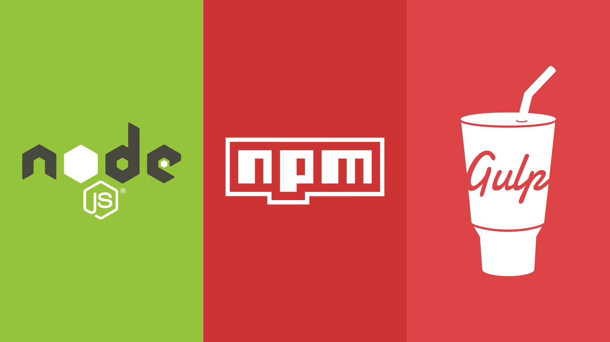
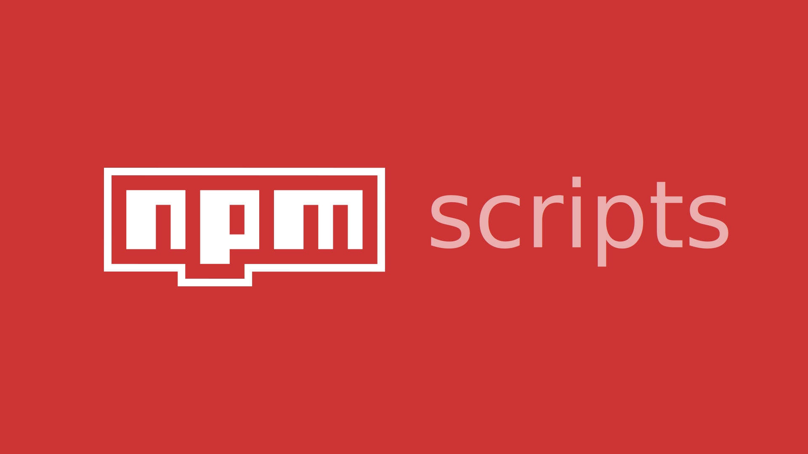
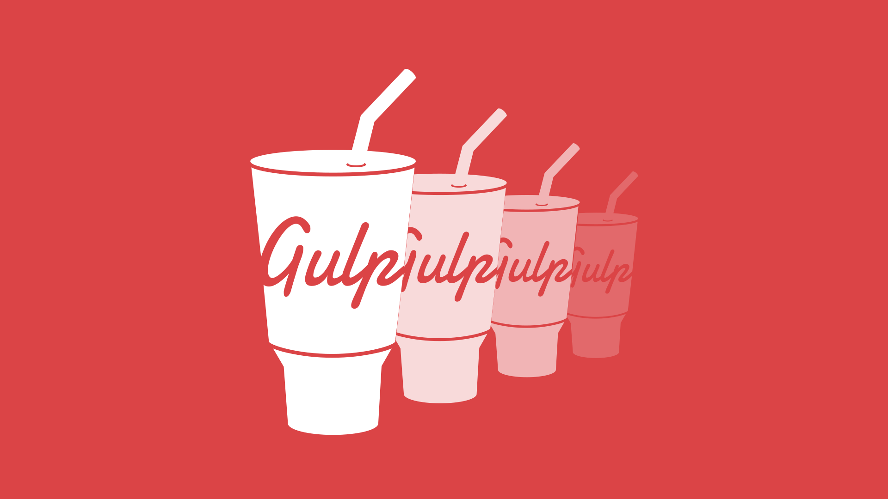

# Gulp compiler

## Gulp Compiler is a basic code for automate the tasks of your development environment with the task runner Gulp. This project has functions for create a server, copy and paste folders/files, compile and compress files and watch his changes


# Development interface

Is developed with [gulp](https://gulpjs.com/) 4.0.0 a task runner and javascript.

`Gulp` is a toolkit for automating painful or time-consuming tasks in your development workflow, so you can stop messing around and build something.

More information: [Introduction to gulp](https://dolphinandmermaids.com/blog/gulp-examples)

# Content


The `SASS` and `JS` compilation tasks pick up the files in the `src` folder and generate a new `dist` folder with the results.  

- Input structure folders

	```
	src/
		js/
			scripts.js
		sass/  
			styles.sass
		index.html
	```

- Output structure folders

	```
	dist/
		css/
			styles.min.css
		js/
			scripts.min.js
		index.html
	```

# First steps



> You can skip this section if you already have NODE, NPM and GULP.

## Installs the necessary

1. Install [Node](https://nodejs.org/es/) and [NPM](https://docs.npmjs.com/)

	- If you are on MAC you can do it with line of following these steps

      - First, install [Homebrew](https://brew.sh/index_es)

  		```
  		/bin/bash -c "$(curl -fsSL https://raw.githubusercontent.com/Homebrew/install/HEAD/install.sh)"
  		```

      - Next, install Node (npm will be installed with Node):
      	```
      	brew install node
      	```

	- Or install node and npm together with this program: [Download](https://www.npmjs.com/get-npm)

2. Install [Gulp 4.0.0](https://gulpjs.com/)

	- Install gulp globally
		```
		npm install --global gulp-cli
		```

	- Install gulp inside project
		``` 
		npm install gulp
		```

## Check the packages installed

1. To test out your `NODE`, `NPM` and `GULP`, check versions installed
   - Check version of node
		```
		node --version
		```
	- Check version of npm
		```
		npm --version
		```
	- Check version gulp
		```
		gulp --version
		```

2. Check the globally installed packages
	```
	npm list -g --depth=0
	```

# How use


## If you already have node, npm and gulp

1. After installing everything you need, cloning this repository.

	```
	git clone https://github.com/beatrizsmerino/gulp-compiler.git
	```

2. For end, you must launch this command, for download the NPM packages and get the dependencies of configuration file [package.json](package.json).

	```
	npm install
	```

## Gulp tasks availables

- You can to list available the gulp tasks of this project, using the command

	```
	gulp --tasks
	```

# NPM



## Project setup

After cloning this repository you need to install the required NPM packages.

```
npm install
```

## Deploy

After development you can publish the content of `dist` folder in Github Pages (`gh-pages` branch)

```
npm run deploy
```

# GULP



In the [gulpfile.js](gulpfile.js) of this proyect you can see the **gulp tasks** developed to compile and compress the `SASS` and `JS`, copy and paste the `HTML` files, create a server and listen to the changes made to reload it ([Browsersync + Gulp.js](https://browsersync.io/docs/gulp))

This version use `gulp.series()`, combines task functions and/or composed operations into larger operations that will be executed one after another, in sequential order.

## 🔧 Run server and watch changes

This is the default gulp task

This command is able to:

1. Creates the `dist` folder if it does not exist.
2. Generate `html`, `css`, `js` on `dist` folder.
3. Watch the changes to the files in the `sass`, and `js` folders inside the `src` folder.
4. Create a server and reloads if there are any changes in those files of `dist` folder.

```
gulp
```

or

```
gulp htmlCopy
gulp sassCompile
gulp cssCompile
gulp jsCompile
gulp watch
```

## 💻  Run server

This create a static server with browserSync package, serves the files from `dist` folder and opens by default the `index.html` file in any of these browsers: Chrome & Firefox.

```
gulp serve
```

or

```
gulp createServer
```

## 📂 Generate html, css and js

This command is able to:

1. Creates the `dist` folder if it does not exist.
2. Generate `html`, `css`, `js` on `dist` folder.

```
gulp build
```

or

```
gulp htmlCopy
gulp sassCompile
gulp cssCompile
gulp jsCompile
```

## 📄 Generate html

This command is able to:

1. Creates the `dist` folder if it does not exist.
2. Copies the `html` files from the `src` folder and pastes the `dist` folder.

```
gulp html
```

or

```
gulp htmlCopy
```

## 📄 Generate css

This command is able to:

1. Creates the `dist` folder if it does not exist.
2. Compile the `styles.sass` file (with the import files of partials sass) located at `src/sass/`, add prefixes to properties css, compress the file, create and add a mapping for the debugger styles sass on the browser inspector, apply a Gulp Plugin for Line Ending Corrector (A utility that makes sure your files have consistent line endings)...
3. Create the `styles.min.css` file and export to `dist/css/` folder.
4. Get list of files of `css` files of `filesCssCompile` variable and concat the files, compress it, add a mapping, apply Line Ending Corrector, overwrite `styles.min.css` and inject updated CSS code to browser without reloading it.

```
gulp css
```

or

```
gulp sassCompile
gulp cssCompile
```

## 📄 Generate js

This command is able to:

1. Creates the `dist` folder if it does not exist.
2. Get list of files of `filesJsCompile` variable, compile the files with Babel NPM package, compress it and apply a Gulp Plugin for Line Ending Corrector (A utility that makes sure your files have consistent line endings)...
3. Export the `scripts.min.js` file to `dist/js` folder.

```
gulp js
```

or

```
gulp jsCompile
```

## 🔎 Watch changes

This command is able to:

1. Create the server.
2. Watch the changes to the files in the `html`, `sass` and `js` folders inside the `src` folder and run the tasks to re-generate the files inside the `dist` folder.
3. Reloads the server if there are any changes to the `html`, `css` and `js` files inside the `dist` folder.

```
gulp watch
```

# 🚀 Another version

There is a more complete version in the branch `feature/gulpfile-front-back`. [Go there](https://github.com/beatrizsmerino/gulp-compiler/tree/feature/gulpfile-front-back)

- This version separate the frontend and backend.
- It has more tasks as minify images and icons.
